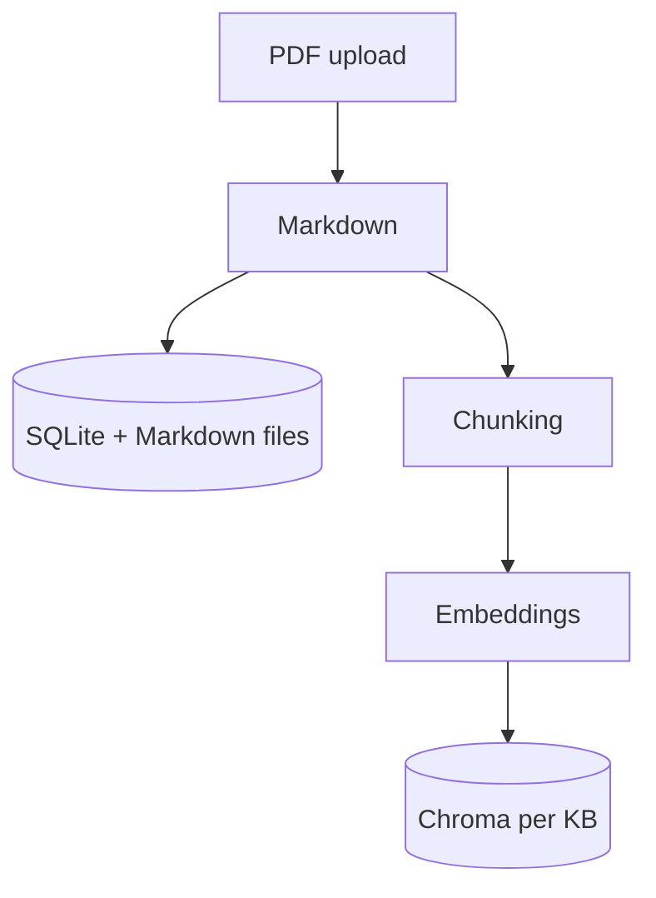
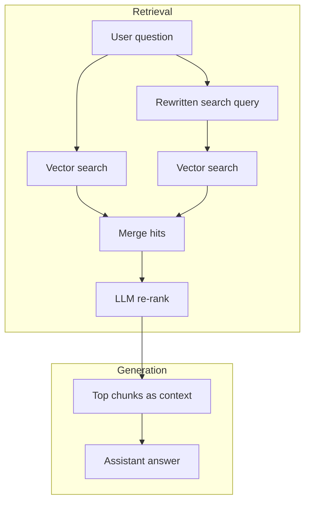

# document-intelligent-retrieval

AI-powered **Document Intelligent Retrieval** (DIR): RAG over PDF knowledge bases with vector retrieval, embeddings, and LLM answers.

## How it works

The app is a **Gradio UI** on top of three main pieces: a **SQLite registry** (knowledge bases and document metadata), **Markdown files** on disk under `data/kbs/`, and a **Chroma** vector store (one collection per knowledge base). Everything user-facing is scoped to a selected knowledge base (“KB”).

Two pipelines matter: **ingestion** (PDFs → searchable vectors) and **retrieval** (question → answer using those vectors).

### Ingestion (PDF → index)

When you upload PDFs, each file is turned into Markdown, stored as a new document row and file, then **chunked**, **embedded**, and **written to Chroma**. Chunking can use an LLM (optional, configurable) or fall back to a recursive text splitter. Duplicate uploads (same content hash) are skipped.



**SQLite** and **on-disk Markdown** store document metadata and source text; **Chroma** stores chunk vectors and metadata (`source`, `document_id`) used at query time.

### Retrieval (question → answer)

When you chat, the app **retrieves** passages from the active KB’s collection, **narrows and re-orders** them with an LLM, then **generates** an answer grounded in that context. Retrieval uses both the raw question and a **short rewritten query** to improve recall; results are merged, **re-ranked**, and only the top chunks are passed to the final model.



So: **two vector queries → merge → re-rank → answer with context**—all tied to the KB slug you selected in the UI.

## Layout

- **`src/document_ir/`** — installable Python package (`document_ir`).
- **`data/`** — local SQLite registry, Chroma store, and Markdown under `data/kbs/` (gitignored by default).

## Run

```bash
cd document-intelligent-retrieval
python -m venv .venv
source .venv/bin/activate   # Windows: .venv\Scripts\activate
pip install -e .
```

Start the UI (any of these):

```bash
pip install -e .   # recommended: registers document_ir for python -m and document-ir
python -m document_ir
document-ir
python app.py      # also works without install: adds src/ to the path automatically
```

Configure API keys via a `.env` file (e.g. OpenAI for embeddings and LiteLLM).

Optional: set **`DOCUMENT_IR_DATA_DIR`** to an absolute path to use that directory instead of `<repo>/data` (useful if the package is installed from a wheel and the repo root is not meaningful).

## Dependencies

Runtime dependencies are declared in **`pyproject.toml`**. Editable install pulls them in.

**`requirements.txt`** is an optional, broader stack (notebooks, ML, etc.); it is **not** required to run the Gradio app alone.
